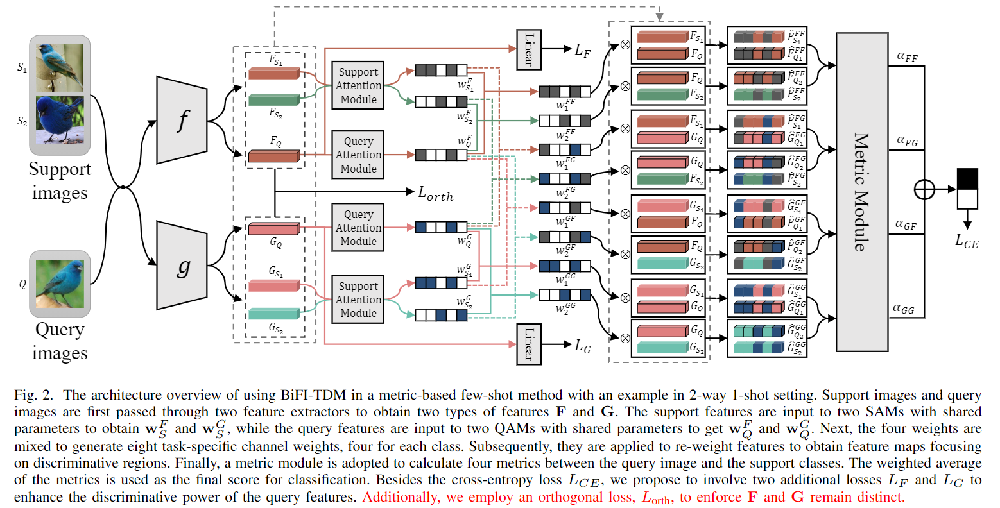
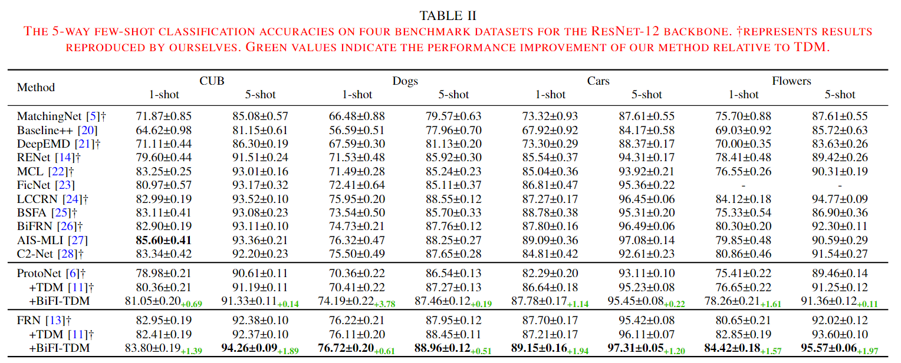
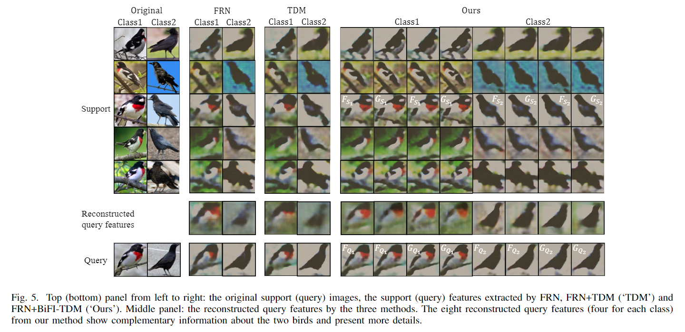

# Rise by Lifting Others: Interacting Features to Uplift Few-Shot Fine-Grained Classification
> **<p align="justify"> Abstract:** *Few-shot fine-grained classification entails notorious subtle inter-class variation. Recent works address this challenge by developing attention mechanisms, such as the task discrepancy maximization (TDM) that can highlight discriminative channels. This paper, however, aims to reveal that, besides designing sophisticated attention modules, a well-designed input scheme, which simply blends two types of features and their interactions capturing different properties of the target object, can also greatly promote the quality of the learnt weights. To illustrate, we design a bi-feature interactive TDM (BiFI-TDM) module to serve as a strong foundation for TDM to discover the most discriminative channels with ease. Specifically, we design a novel mixing strategy to produce four sets of channel weights with different focuses, reflecting the properties of the corresponding input features and their interactions, as well as a proper feature re-weighting scheme. Extensive experiments on four benchmark fine-grained image datasets showcase superior performance of BiFI-TDM in metric-based few-shot methods.* </p>

# Approach

# Data Preparing
1. First, you need to set the value of `data_path` in the `config.yml` file to your dataset path.
2. The following datasets are used in our paper:
   - `CUB_fewshot_crop`: 100/50/50 classes for train/validation/test, using bounding-box cropped images as input.
   - `Stanford-Dogs`: 60/30/30 classes for train/validation/test.
   - `Stanford-Cars`: 130/17/49 classes for train/validation/test.
   - `Oxford-Flowers`: 51/26/25 classes for train/validation/test.

# Model Training and Testing
Our BiFI-TDM can be attached to any metric-based few-shot models. Our paper and code take ProtoNet and FRN as examples of metric modules.

To train a model with ProtoNet as the metric module from scratch using the `CUB` dataset, you can navigate to the `/Experiments/cub_crop/BiFI-TDM-Proto/ResNet-12_1-shot` subfolder. This folder contains two files: `train.py ` and `train.sh`. Running the shell script `train.sh` will train and evaluate the model using hyperparameters that match our paper. The explanations for these hyperparameters can be found in `trainers/trainer.py`.
```
cd /Experiments/cub_crop/BiFI-TDM-Proto/ResNet-12_1-shot
sh train.sh
```
To train a model with FRN as the metric module, you can run the following command:
```
cd /Experiments/cub_crop/BiFI-TDM-FRN/ResNet-12
sh train.sh
```
Model evaluation is based on the code `tm.evaluate(model)`(the last line) in `train.py`. You can also create a separate file dedicated to model testing.
# Fine-grained Few-shot Image Classification


# Qualitative Comparisons via Visualisations
We first provide visual comparisons of the discriminative regions in the next figure for the Cars and Aircraft datasets with FRN as the metric module. FRN+BiFI-TDM can identify the most delicate areas to distinguish subcategories, compared with FRN+TDM and FRN. Moreover, consistent areas are highlighted. For example, to classify cars, the headlights and the front logos are important, while to classify aircrafts, the tails painted with company logos are commonly identified. This also matches how humans recognise cars and aircraft.


Additionally, we depict two examples of the reconstructed query images in the CUB dataset through FRN. In the next figure, the upper and bottom panels visualise the features of the support and query images, while the middle panel presents the reconstructed query images. In FRN+BiFI-TDM, four reconstructed images are obtained via the four sets of features. It is clear that the different features can capture more detailed information than the base features; thus, utilising them can provide better classification results. This is consistent with the analysis in Table 3. Not surprisingly, the reconstructed query images of our method also present more details. Moreover, the four reconstructed images show complementary details, suggesting that all sets of features shall be involved to determine the image labels.


Finally, we visualized the $w$'s in Eq.6 in the next figure to validate that the four sets of channel weights identify different discriminative channels. The darker the colour is, the higher the weight of the channel. Plain FRN gives all channels the same weight of 1 while TDM highlights discriminative channels. The four rows of our method correspond to $w^{FF}$, $w^{FG}$, $w^{GF}$, and $w^{GG}$, respectively. Clearly, they weigh different channels, and this pattern is more obvious in the Cars dataset.

